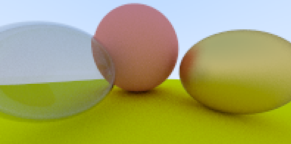

# ray-tracing-in-ocaml

“[Ray Tracing in One Weekend](https://www.amazon.co.jp/Tracing-Weekend-Minibooks-Book-English-ebook/dp/B01B5AODD8)” を読みながら OCaml でレイトレを実装するリポジトリ。



## How to run

```
make
open img.ppm
```
